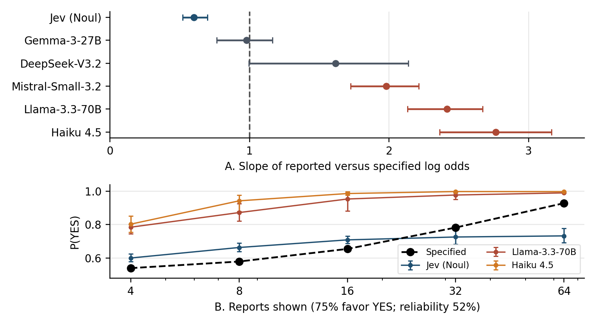

# Evidence weighting in model probabilities

Suppose 48 of 64 reports favor YES. If each report is 55% reliable, the reports are independent given the outcome, and YES and NO are equally likely at the start, the probability of YES is 0.998. TypeSafe's Jev gave 0.762 on average with its Noul probability readout (95% bootstrap interval 0.732 to 0.788). In separate yes/no questions about individual reports, Jev identified 33,039 of 33,048 correctly.

This repository contains the code and results for that experiment and related tests with language models. Jev's other readouts can behave differently. The [full results](experiments/evidence_count/results/summary.md) show the tested conditions and limitations.



## Experiments

| Directory | What it contains |
| --- | --- |
| [`experiments/evidence_count/`](experiments/evidence_count/) | Synthetic reports, a decisive-report control, prompts, analysis, and results |
| [`experiments/pair_matching/`](experiments/pair_matching/) | Detecting forbidden pairs of names in longer rosters |
| [`experiments/product_reviews/`](experiments/product_reviews/) | Tests against held-out Amazon review ratings |
| [`experiments/open_models/`](experiments/open_models/) | Kev probes, interventions, and fine-tuning on synthetic cases |
| [`api/`](api/) | Hosted-model clients and usage logging |

Each experiment includes code and aggregate results under `results/`. The activation-swap tests did not pass their positive control, so they cannot establish a mechanism. The fine-tuning results are exploratory, with one seed per condition.

## Run the released code

Use Python 3.12 or newer. From the repository root:

```sh
python3 -m venv .venv
source .venv/bin/activate
python -m pip install -r requirements.txt
python -m unittest discover -s experiments/evidence_count -p 'test_generate.py'
python -m pytest -q experiments/pair_matching/test_generate.py
python -m unittest discover -s experiments/product_reviews -p 'test_sample.py'
python experiments/evidence_count/generate.py --output experiments/evidence_count/cases.jsonl
python experiments/pair_matching/generate.py
python plot_evidence.py
```

These commands generate cases and rebuild the figure without calling a model. `plot_evidence.py` writes `figures/evidence.pdf` and `figures/evidence.png` from the released metrics. [Example prompts](experiments/evidence_count/results/examples.md) are included.

For the synthetic reports, `n` is the number of reports, `k` is the number favoring YES, and `r` is each report's chance of naming the correct outcome. With an equal prior and conditionally independent reports of the same reliability in both directions, the reference log odds are `(2k - n) log(r / (1-r))`. Log odds means the log of the YES-to-NO probability ratio.

## Rerunning model calls

- To run the independent-report or pair-matching experiments, see [`evidence_count/run.py`](experiments/evidence_count/run.py) and [`pair_matching/run.py`](experiments/pair_matching/run.py). Both accept `--help`. Set `TYPESAFE_API_KEY`, `OPENROUTER_API_KEY`, or `ANTHROPIC_API_KEY` for the model you choose. Responses go to that experiment's `results/raw/` directory.
- For product reviews, run `experiments/product_reviews/sample.py`, then `extend_sample.py`, to sample the `Health_and_Personal_Care` category of [Amazon Reviews 2023](https://huggingface.co/datasets/McAuley-Lab/Amazon-Reviews-2023). Held-out ratings provide an empirical target rather than an exact probability from stated assumptions. The download follows the dataset's `main` revision, which may change.
- For GPU experiments, `experiments/open_models/modal_app.py` runs on Modal and fetches [Kev](https://github.com/jaredpalmer/kev) at commit `d32a973cc2375f1c76e898cbf6e759c4499042de`. Fine-tuning labels come from the synthetic probability rule, not Jev outputs.

Historical hosted-model responses, downloaded reviews, activations, and checkpoints are not included. You can inspect and plot the released aggregates, but reconstructing the historical estimates requires the omitted raw data. Fresh model calls will give new measurements.

## License

MIT. See [LICENSE](LICENSE).
